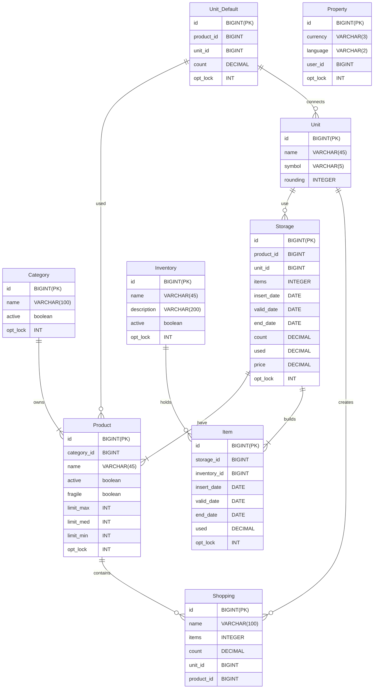

```mermaid
erDiagram
    Category ||--|{ Product: owns
    Storage ||--|{ Product : have
    Unit ||--o{ Storage : use
    Inventory ||--o{ Item: holds
    Storage ||--|{ Item : builds
    Unit_Default ||--o{ Product : used
    Unit_Default ||--o{ Unit : connects
    Product ||--o{ Shopping : contains
    Unit ||--o{ Shopping : creates
    Category {
        id BIGINT(PK)
        name VARCHAR(100)
        active boolean
        opt_lock INT
    }
    Inventory {
        id BIGINT(PK)
        name VARCHAR(45)
        description VARCHAR(200)
        active boolean
        opt_lock INT
    }
    Product {
        id BIGINT(PK)
        category_id BIGINT
        name VARCHAR(45)
        active boolean
        fragile boolean
        limit_max INT
        limit_med INT
        limit_min INT
        opt_lock INT
    }
    Unit {
        id BIGINT(PK)
        name VARCHAR(45)
        symbol VARCHAR(5)
        rounding INTEGER
    }
    Storage {
        id BIGINT(PK)
        product_id BIGINT
        unit_id BIGINT
        items INTEGER
        insert_date DATE
        valid_date DATE
        end_date DATE
        count DECIMAL
        used DECIMAL
        price DECIMAL
        opt_lock INT
    }
    Item{
        id BIGINT(PK)
        storage_id BIGINT
        inventory_id BIGINT
        insert_date DATE
        valid_date DATE
        end_date DATE
        used DECIMAL
        opt_lock INT
    }
    Unit_Default{
        id BIGINT(PK)
        product_id BIGINT
        unit_id BIGINT
        count DECIMAL
        opt_lock INT
    }
    Shopping{
        id BIGINT(PK)
        name VARCHAR(100)
        items INTEGER
        count DECIMAL
        unit_id BIGINT
        product_id BIGINT
    }
    Property{
        id BIGINT(PK)
        currency VARCHAR(3)
        language VARCHAR(2)
        user_id BIGINT
        opt_lock INT
    }
```